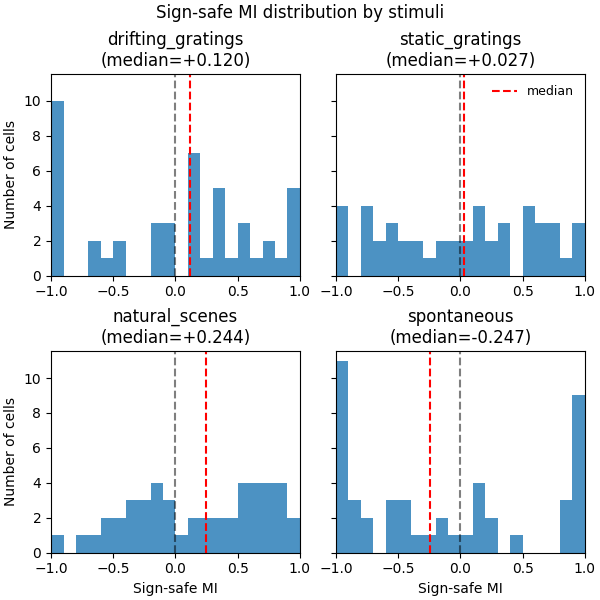

# Binary Modulation

## 1. Methods
Each trial is assigned a behavioral state from its running-speed trace. Running trials have mean speed above 3.0 cm/s with every frame above 0.5 cm/s; still trials have mean speed below 0.5 cm/s with every frame below 3.0 cm/s; all remaining trials are ignored.

To compare running-related modulation across spontaneous activity and three visually evoked conditions, we first examined the raw responses. 

1. **Sign-safe Modulation Index (MI)**: As heterogeneous negative values made conventional MI unstable, we used sign-safe MI as the primary normalized metric: 
    $$
    MI_{\mathrm{safe}} = \frac{R_{\mathrm{run}} - R_{\mathrm{still}}}
    {|R_{\mathrm{run}}| + |R_{\mathrm{still}}| + \epsilon} \in [-1, 1]
    $$ 
    with epsilon = $10^{-12}$ preventing division by zero. Its denominator is never negative, so $MI_{\mathrm{safe}}$ is bounded in [-1, 1] and always carries the sign of $R_{\mathrm{run}}$ - $R_{\mathrm{still}}$. The denominator-free sensitivity measure is $\Delta R = R_{\mathrm{run}} - R_{\mathrm{still}}$.
2. **Gain model**: $$ R_{\mathrm{run}} = aR_{\mathrm{still}} + b $$, where $a$ represents multiplicative gain and $b$ represents an additive shift.

## 2. Results

### 2.1 MI: Running had opposite effects on evoked and spontaneous activity.

Median sign-safe MI was positive for SG, DG, and NS, but negative during the no-stimulus condition. This suggests that running is associated with enhanced evoked responses but suppressed no-stimulus activity.

>  The effect is a *population tendency* rather than a universal one, since only 53 to 57 percent of cells are positive under evoked stimuli.

Among the three stimuli, NS had the largest median modulation, while SG had the smallest. 

### 2.2 Gain model: Weak fits

It was shown that the additive term \(b\) was close to zero, while the multiplicative term \(a\) differed across stimuli and was largest for NS. However, the low median $R^2$ values ($< 0.11$) show that the model did not explain neuron-level variation well.

| stimulus          |   median_gain_a |   median_gain_b |   median_r2 |   median_n_conditions |   frac_gain_a_gt_1 |
|:------------------|----------------:|----------------:|-----------------:|----------------------:|-------------------:|
| drifting_gratings |        0.109  |      0.00125  |        0.108  |                     6 |          0.085 |
| static_gratings    |        0.273|      0.00234 |        0.054 |                   120 |          0.085 |
| natural_scenes   |        0.452 |      0.00912 |        0.047 |                   118 |          0.234  |

~~4. **The results were not equally robust across stimuli.** SG and NS agreed well with the Allen indices, while DG showed weaker agreement and should be interpreted with caution.~~

Overall, running was associated with stronger visually evoked activity and weaker spontaneous activity. Natural scenes showed the strongest modulation, and the gain-model results were more consistent with multiplicative than additive effects.