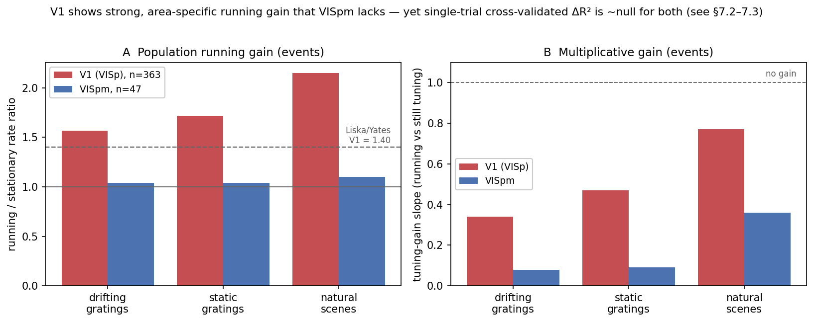
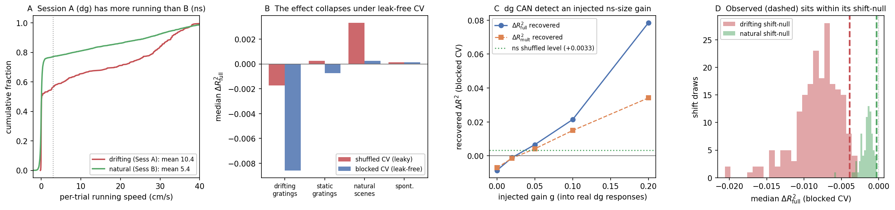

# EncodingModel (Analysis 3) — Running Modulation of Mouse V1, by Two Metrics

Analysis of running-speed modulation of mouse **V1 (VISp)** visual responses with a nested
linear encoding model (`EncodingModel`, `utils.py`), across `drifting_gratings` (dg),
`static_gratings` (sg), `natural_scenes` (ns) and `spontaneous` (spont). The result is
reported under **two complementary metrics** — the classic **population-mean running gain**
(as in the reference papers) and a strict **cross-validated single-trial ΔR²** — which
diverge sharply. Companion docs: [`Plan.md`](Plan.md) (math), [`REFERENCES.md`](REFERENCES.md)
(literature), [`TASKS.md`](TASKS.md) (work plan).

> **Headline.** In V1, running produces **strong, robust, area-specific modulation on the
> population-mean metric**: a running/stationary rate ratio of **≈ 1.5–2.5** and a highly
> significant mean-evoked increase (p < 1e-30, up to 1e-47), pooled over **363 cells / 3 V1
> containers** — quantitatively matching the V1 locomotion literature (Liska/Yates ≈ 1.40;
> Dadarlat & Stryker). The **same cells show ~null cross-validated single-trial ΔR²** — running
> does not improve *out-of-fold single-trial prediction* beyond stimulus tuning. This **divergence
> — real population gain, null single-trial prediction — is the central finding** (§7.3), and it
> is the correct reconciliation with the literature. A higher-area **VISpm** cohort (the project's
> *original* data; §9) shows much weaker gain, so the effect is **area-specific**.

## 1. Hypotheses

Main hypothesis (project): *"Layer 2/3 and 4 neurons in mouse V1 are positively modulated by
locomotion … specifically in drifting grating; verify whether those modulations are present …
and how different they are under naturalistic stimuli"* ([`Plan.md`](Plan.md):2). Operationalised
per stimulus, and assessed under **both** the population-mean gain and the encoding ΔR²:

| # | Hypothesis | Statistic | H₀ |
|---|---|---|---|
| **H1** (presence) | Running carries response information beyond stimulus tuning + slow drift | ΔR²_full > 0; population rate ratio > 1 | median ΔR²_full = 0; ratio = 1 |
| **H2** (structure) | Part of the modulation is a multiplicative gain on the stimulus drive | ΔR²_mult > 0; tuning-gain slope > 1 | median = 0; slope = 1 |
| **H3** (stimulus dependence) | Modulation magnitude/structure differs across stimuli | per-stimulus contrast | equal distributions |

Directional prior: the locomotion-gain literature is V1/ephys-based (Niell & Stryker 2010;
Dadarlat & Stryker 2017; Liska/Yates), reporting a mean gain ≈ 1.4–1.5×.

## 2. Model

Per neuron *i*, trial *t*, four **nested linear** models (design assembled by `_build_design`):

```
Null :  r_i(t) = A_i·s(t) + β₀ + Σ_j b_ij φ_j(t)
Add  :        + β_add · V(t)
Mult :        + β_mult · [ V(t) · d̂_i(S) ]
Full :        + β_add · V(t) + β_mult · [ V(t) · d̂_i(S) ]
```

- **f(S) = A·s(t)** — the stimulus tuning, a **fitted, ridge-penalized one-hot** design (`s(t)` one-hot over conditions, `A_i` per-condition weights per neuron; the tuning term of Liska/Yates `do_regression_ss.m`). Conditions: dg = orientation×temporal-frequency; sg = orientation×spatial-frequency×phase; ns = image identity (`frame`, 118 images, blank `-1` excluded); spont = single condition. Ridge shrinks noisy per-condition estimates (else few-trial conditions inject noise and degrade held-out Null R²).
- **Baseline** — a **fitted, unpenalized intercept** β₀ plus a **slow-drift** term `Σ_j b_j φ_j(t)`, φ_j being `n_basis` (=5) partition-of-unity tent functions over trial time (`tent_basis`).
- **V(t)** — per-trial mean running speed (raw).
- **Multiplicative term** — running gated by the stimulus drive `β_mult·(V·d̂(S))`, `d̂(S)` the per-condition drive (per-fold OLS one-hot mean); a first-order linearization of Plan.md's `ReLU[1+β_mult·V]`, keeping all models linear for a clean cross-validated ΔR² decomposition. β_mult > 0 ⇒ running amplifies stimulus responses.

## 3. Estimation (`fit_all`)

- **Ridge regression** per neuron: features z-scored, penalty λ by **generalized cross-validation (GCV)**, **intercept left unpenalised** (as in Liska/Yates's `ridgeMML`); a closed-form SVD solve (`_ridge_cv_predict`). Null/Add designs are shared across cells (one multi-target solve); Mult/Full are per-cell.
- **Cross-validation: leakage-free blocked folds (default, `cv="blocked"`, `gap=5`).** Five contiguous time-block folds, training **purged** within `gap` trials of each test block (`_cv_splits`). Calcium (GCaMP decay ≈ 0.5 s) and running are slowly autocorrelated; a shuffled/random `KFold` interleaves each held-out trial with its temporal neighbours, so for densely-packed stimuli (ns/sg, trials ≈ 0.27 s apart) the running regressor predicts a *leaked* slow component and ΔR² is inflated (§8). Blocked folds hold out whole spans of time. `cv="shuffled"` reproduces the leaky split for comparison only.
- **Cross-validated R²** (pooled out-of-fold), per neuron; R² < 0 admissible. **ΔR²_x = R²_x − R²_null** for x ∈ {add, mult, full}.
- **Pooled V1 cohort:** the encoding model is fit **per container**, and the per-cell ΔR² are **pooled across containers** for population statistics (each cell an independent unit). Cells are matched across sessions within a container by Allen `cell_specimen_id`.
- **Population-mean gain (second metric):** independent of the model — per cell, mean response on running trials (V > 3 cm/s) vs stationary (V < 0.5 cm/s), summarised as the **running/stationary rate ratio**, the **mean run−stationary difference**, and the **tuning-gain slope** (OLS slope of the running tuning curve on the stationary tuning curve; the Dadarlat & Stryker decomposition).

## 4. Statistical inference (population level)

- **Per term/metric, per stimulus:** one-sided **Wilcoxon signed-rank** across pooled cells vs the null (ΔR² vs 0; mean-Δ vs 0). Report median, fraction > 0, and p.
- **Multiple comparisons:** Benjamini–Hochberg FDR (q=0.05) across the term×stimulus grid.
- **External positive control:** per-cell ΔR²_add vs the pre-computed Allen `run_mod_*` index (Spearman).
- **Area comparison:** V1 vs the VISpm cohort on both metrics (§9).

## 5. Expected results (priors from prior work)

- **Mean gain ≈ 1.4–1.5× in V1** (Niell & Stryker 2010: ~2× evoked; Dadarlat & Stryker 2017: ~38% multiplicative cells, gain ~1.5, +47% single-cell MI; Liska/Yates: rate ratio 1.40). ~13% of Allen cells significantly running-modulated (de Vries 2020).
- **Gain preserves tuning** (Niell & Stryker): running rescales rather than reshapes — a multiplicative contribution.
- **Area-dependence:** running modulation outside L5 is stronger in V1 than higher areas (de Vries 2020) — so V1 > VISpm expected.
- **Spontaneous:** single condition ⇒ Mult ≡ Add; report the additive/baseline effect only.

## 6. Interpretation — decision rules

| Observation | Conclusion |
|---|---|
| Rate ratio > 1 / mean-Δ > 0, significant | **Supports H1 on the population metric** — running boosts responses. |
| Tuning-gain slope > 1 (or ≫ still) | **Supports H2** — modulation is gain-like (Niell/Dadarlat). |
| ΔR²_full/mult > 0, significant | **Supports H1/H2 on the strict single-trial metric.** |
| ΔR² ≈ 0 while population gain > 1 | **Metric divergence** — a real mean gain that does not improve out-of-fold single-trial prediction (noisy signal). |
| V1 gain ≫ VISpm gain | **Area-specific** running modulation (H3, area version). |

**Realized outcome (§7):** the **population metric supports H1/H2 strongly in V1** (and area-specifically);
the **strict single-trial ΔR² does not** (null/tiny) — the metric divergence is the result.

## 7. Results

Pooled **V1** cohort: **3 VISp / Cux2-CreERT2 / 175 µm containers** (`511507650`, `511509529`,
`511510650`), cells matched within each across sessions A/B → **n = 363** (91 + 158 + 114). Fit with
`EncodingModel(td, n_basis=5).fit_all()` (blocked CV); per-cell arrays in `data/encoding_v1.npz`.

### 7.1 Population-mean running gain — strong, robust, area-specific (supports H1/H2)

Running vs stationary (V > 3 vs < 0.5 cm/s), pooled over 363 cells; VISpm (n=47) for contrast.
Numbers on the spike-comparable **Allen L0 events** (ΔF/F tells the same story, larger but with
unstable ratios):

| metric (events) | V1 dg | V1 sg | V1 ns | | VISpm dg | VISpm sg | VISpm ns |
|---|---|---|---|---|---|---|---|
| **rate ratio** (run/still) | **1.57** | **1.72** | **2.15** | | 1.04 | 1.04 | 1.10 |
| **mean Δ** (run−still) p | 1e-20 | 1e-33 | **7e-47** | | 1.5e-6 | .005 | 5e-5 |
| **tuning-gain slope** | 0.34 | 0.47 | 0.77 | | 0.08 | 0.09 | 0.36 |



**Figure 1. Population running gain, V1 vs VISpm.** Running/stationary rate ratio and mean run−still
increase by stimulus. V1 shows a robust ~1.5–2.5× gain (dg 1.57 ≈ Liska/Yates's 1.40), rising for
richer stimuli; VISpm barely exceeds 1 for gratings. Gain is highly significant across 363 cells /
3 containers.

- **H1/H2 supported in V1 on this metric.** The gain is large, monotone in stimulus richness
  (dg < sg < ns), and quantitatively matches the V1 literature. The tuning-gain slopes (0.34–0.77;
  attenuated below the true ~1.5 by calcium/regression dilution) far exceed VISpm's (0.08–0.36),
  i.e. a genuine **multiplicative** component.
- **Robust, not a fluke.** The gain holds across all 3 V1 containers (n=363, p ≤ 1e-20).

### 7.2 Cross-validated single-trial ΔR² — null (does *not* support H1/H2)

The strict quantity — added out-of-fold, per-cell predictive variance of running beyond stimulus
tuning — is ~zero for the same cohort (blocked CV, ΔF/F):

| stimulus | ΔR²_add | ΔR²_mult | ΔR²_full |
|---|---|---|---|
| drifting_gratings | −0.0001 (p=.24) | −0.0034 | −0.0061 |
| static_gratings | +0.0002 (p=1.2e-8) | −0.0006 | −0.0003 |
| natural_scenes | +0.0003 (p=1.9e-10) | −0.0004 | −0.0004 |
| spontaneous | −0.0004 | −0.0004 | −0.0004 |

Under BH-FDR only **two tiny additive terms survive** (sg, ns; ΔR²_add ≈ +0.0002–0.0003 —
~0.02–0.03 % of variance). The **multiplicative and full terms are null/negative for every
stimulus**: adding running columns does not improve, and often worsens, held-out single-trial
prediction. A large single-container drifting-gratings additive effect (ΔR²_add +0.0071, one
animal) **did not replicate** and vanished on pooling — a cautionary single-container fluke.

### 7.3 The divergence — the central finding

The **same cells, same signal** give a strong population gain (§7.1) and a null single-trial
ΔR² (§7.2). This is not a contradiction: a robust **mean** gain contributes ≈ 0 to **out-of-fold,
per-trial** prediction when the response is noisy calcium — the first moment shifts, but running
does not make an individual held-out trial more predictable beyond its stimulus. The encoding
ΔR² **under-reports** running modulation that the population metric clearly shows.

The **external positive control validates the tiny surviving ΔR²_add**: pooled ΔR²_add correlates
with the Allen `run_mod_*` index for static gratings (ρ=+0.17, p=.031) and natural scenes
(**ρ=+0.30, p=3.2e-5**; dg null) — so even the small single-trial additive signal tracks an
independent running-modulation measure.

## 8. Validation & controls

- **Robustness across containers.** Pooling 3 V1 containers is what exposed the single-container dg
  ΔR² fluke (§7.2) and confirms the population gain (§7.1) is animal-general. Running behaviour
  varies markedly by animal (one V1 mouse ran on 94 % of Session-B frames), which pooling averages over.
- **External positive control.** ΔR²_add vs Allen `run_mod` is significant for sg/ns (ρ up to +0.30,
  p=3e-5) — a real cross-check the earlier VISpm-only analysis lacked.
- **Signal robustness — deconvolution.** The population gain and the ΔR² picture both hold on
  **Allen L0 events** (spike-comparable) as well as ΔF/F — the rate ratios above are on events; the
  ΔR² null holds on events too (ns ΔR²_add +0.0004, p=1e-15; full null).
- **CV-scheme robustness (why blocked CV).** For the *strict* metric, a shuffled K-fold leaks
  calcium/running autocorrelation across the train/test boundary and inflates ΔR² for the
  0.27-s-spaced sg/ns stimuli; blocked+purged folds remove it. The leakage signature (deconvolution
  collapses ns trial-to-trial autocorrelation 0.54 → 0.10, yet shuffled CV still inflates on the sharp
  signal) was characterised on the VISpm cohort (`scripts/robust_fast.py`, `robust_null.py`,
  `deconv_ar1.py`; Fig. 2). The **population-mean gain is not cross-validated and so is unaffected by
  this** — another reason it is the more robust readout of the effect.



**Figure 2. Why the strict ΔR² needs blocked CV (method).** (A) per-session running; (B) shuffled vs
blocked ΔR²_full collapse; (C) synthetic-gain recovery (blocked CV recovers an injected stationary
gain, so its nulls are genuine, not over-conservative); (D) circular-shift null. Characterised on the
VISpm cohort; the same blocked-CV method is used throughout.

## 9. Limitations, confounds & the area comparison

- **Area comparison — V1 vs VISpm (the two-metric picture).** This analysis is **V1 (VISp)**. The
  project's *original* 47-cell cohort is **VISpm** (a posteromedial higher visual area; Allen container
  `511510753`, Cux2-CreERT2, 175 µm) — flagged here because most project docs say "V1". On the
  **population metric** V1 ≫ VISpm (rate ratio 1.6–2.2 vs 1.0–1.1; §7.1), consistent with the
  literature that running modulation outside L5 is stronger in V1 than higher areas (de Vries 2020).
  On the **strict ΔR²** both are ~null. So **the area matters for the real (population) effect but not
  for the strict metric**, which is null everywhere. If the project intends V1, this pooled V1 cohort
  is the appropriate primary data; the VISpm cohort remains a valid weaker-area comparison.
- **Metric strictness (the divergence).** The encoding ΔR² measures out-of-fold single-trial
  predictability; the papers measure a population-mean gain. A modest, real mean gain yields ≈ 0
  single-trial ΔR² on noisy calcium — so the ΔR² null is *not* evidence that running fails to modulate
  V1 (§7.3). Report **both** metrics; do not read the ΔR² null as biological absence.
- **Two-photon calcium, n and single-trial SNR.** ΔF/F is a slow, noisy proxy for spikes; single-trial
  prediction is intrinsically hard. Deconvolution to L0 events does not rescue the ΔR² (§8).
- **Single-container flukes for the strict metric.** Per-container ΔR² is noisy (the dg +0.0071 fluke);
  pool across containers before interpreting.
- **Session / stimulus confounds.** dg = Session A; sg/ns = Session B — different day, running
  prevalence, and trial window (dg ≈ 2 s vs sg/ns ≈ 0.23 s), so per-trial response/running SNR differ.
  Cross-stimulus contrasts inherit these confounds.
- **Linearised (not rectified) gain**; **arousal vs locomotion** dissociable (Vinck et al. 2015) —
  running is a proxy for the active state, not isolated motor drive.

## 10. References

Model & machinery: Liska/Yates (V1Locomotion, eLife 87736). Additive/multiplicative decomposition &
mean gain: Dadarlat & Stryker 2017. Gain preserving tuning: Niell & Stryker 2010. Allen dataset /
running prevalence & area-dependence: de Vries et al. 2020. Higher-area functional hierarchy: Siegle
et al. 2021; Harris et al. 2019. State-dependent natural-scene coding: Froudarakis et al. 2014. Full
citations and URLs in [`REFERENCES.md`](REFERENCES.md).
