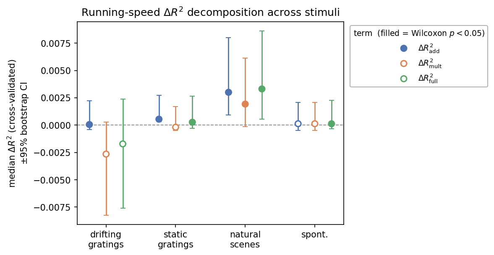
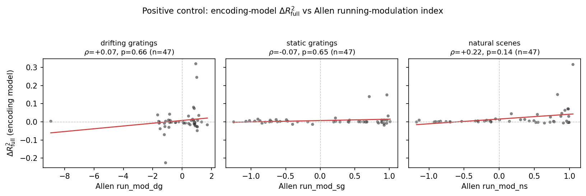

# EncodingModel (Analysis 3) — Methodology, Predictions & Interpretation

Predictive nested-model analysis of running-speed modulation of V1 ΔF/F, implemented
in `EncodingModel` (`utils.py`). This document defines the model and estimator, states
the hypotheses it tests, gives the quantitative expectations from prior work, and fixes
the decision rules by which the results support or disprove the main hypothesis.
Companion docs: [`Plan.md`](Plan.md) (math), [`REFERENCES.md`](REFERENCES.md) (literature),
[`TASKS.md`](TASKS.md) (work plan).

## 1. Hypotheses

Main hypothesis (project): *"Layer 2/3 and 4 neurons in mouse V1 are positively modulated by
locomotion … specifically in drifting grating; verify whether those modulations are present …
and how different they are under naturalistic stimuli"* ([`Plan.md`](Plan.md):2). Operationalised
as three testable claims, per stimulus S ∈ {`drifting_gratings` (dg), `static_gratings` (sg),
`natural_scenes` (ns), `spontaneous` (spont)}:

| # | Hypothesis | Statistic | H₀ |
|---|---|---|---|
| **H1** (presence) | Running carries response information beyond stimulus tuning + slow drift | ΔR²_full > 0 across the population | median ΔR²_full = 0 |
| **H2** (structure) | Part of the modulation is a multiplicative gain on the stimulus drive | ΔR²_mult > 0; ΔR²_mult vs ΔR²_add | median ΔR²_mult = 0 |
| **H3** (stimulus dependence — the crux) | Modulation magnitude/structure differs **gratings (dg, sg) vs natural (ns)**; spont is the no-stimulus baseline | ΔR²_mult(gratings) vs ΔR²_mult(ns) | equal distributions |

Directional prior: the locomotion-gain literature is grating-based (H1/H2 expected for dg, sg),
whereas the natural-scene case has **no precedent**: a positive natural-scene signature would be
novel and is predicted by state-dependent sparsening (Froudarakis et al. 2014).

## 2. Model

Per neuron *i*, trial *t*, four **nested linear** models (design assembled by `_build_design`):

```
Null :  r_i(t) = A_i·s(t) + β₀ + Σ_j b_ij φ_j(t)
Add  :        + β_add · V(t)
Mult :        + β_mult · [ V(t) · d̂_i(S) ]
Full :        + β_add · V(t) + β_mult · [ V(t) · d̂_i(S) ]
```

- **f(S) = A·s(t)** — the stimulus tuning, a **fitted, ridge-penalized one-hot** design: `s(t)` is a one-hot vector over stimulus conditions and `A_i` are per-condition weights fit per neuron — exactly the tuning term of Liska/Yates (`do_regression_ss.m`). Conditions: dg = orientation×temporal-frequency; sg = orientation×spatial-frequency×phase; ns = image identity (`frame`, 118 images, blank `-1` excluded by `extract_trials`); spont = single condition. **Ridge shrinks the noisy per-condition estimates** — this matters: an unpenalized/OLS tuning (or a coefficient-1 offset) injects per-condition noise for few-trial conditions and breaks the Allen `run_mod` positive control (§8).
- **Baseline** — a **fitted, unpenalized intercept** β₀ plus a **slow-drift** term `Σ_j b_j φ_j(t)`, where φ_j are `n_basis` (=5) partition-of-unity tent functions over trial time (`tent_basis`). No constant design column; the intercept is the baseline and the tent basis captures drift around it.
- **V(t)** — per-trial mean running speed (raw; `extract_trials` does not clamp, so small tracking-noise negatives occur, inconsequential for a linear regressor).
- **Multiplicative term** — running gated by the stimulus drive: `β_mult·(V·d̂(S))`, where `d̂(S)` is the per-condition drive (the per-fold OLS one-hot mean). This is the first-order linearization of Plan.md's rectified gain `ReLU[1+β_mult·V]`, keeping all four models linear (a clean cross-validated ΔR² decomposition — the project's target quantity, which neither reference computes). We do **not** fit the single-scalar gain that scales the *fitted* drive by alternating least squares: the exploration found that gain negligible for gratings and unnecessary to restore the control (§7). β_mult > 0 ⇒ running amplifies stimulus responses.

## 3. Estimation (`fit_all`)

- **Ridge regression** per neuron: features z-scored, penalty λ chosen by **generalized cross-validation (GCV)**, and the **intercept (baseline) left unpenalised** (as in Liska/Yates's `ridgeMML`). A closed-form SVD solve (`_ridge_cv_predict`); the stimulus-only Null/Add designs are identical across cells, so all 47 neurons are fit in a single multi-target solve (Mult/Full are per-cell — the interaction column is cell-specific). Ridge curbs the extra-parameter overfitting that would otherwise let Full win trivially.
- **5-fold cross-validation** (`KFold`, shuffled, seed 0). The tuning `A·s(t)` is fit jointly each fold; the multiplicative gate `d̂(S)` is recomputed from *training* trials only (`_fold_stimulus_mean`) so the R² stays leakage-free.
- **Cross-validated R²** (pooled out-of-fold): `R² = 1 − Σ_t (y − ŷ_cv)² / Σ_t (y − ȳ)²`, per neuron. R² < 0 is admissible and meaningful (model predicts worse than the mean).
- **ΔR²_x = R²_x − R²_null** for x ∈ {add, mult, full} (`r2_decomposition`).

## 4. Statistical inference (population level)

- **Per term, per stimulus:** one-sided **Wilcoxon signed-rank** test of {ΔR²_x} across the 47 neurons vs 0 (H₀: median = 0). Report median ΔR²_x, the fraction of neurons > 0, and p.
- **H3 (gratings vs natural):** compare {ΔR²_mult} for gratings vs ns with a **Mann–Whitney U** test (or a paired signed-rank test across the same matched neurons). This is the pre-specified primary comparison.
- **Responsiveness restriction (sensitivity):** repeat on stimulus-responsive neurons only (`p_dg/p_sg/p_ns` < 0.05, and/or `reliability_*`), since ~34% of Allen neurons are unresponsive and effects are expected in a minority.
- Report all three ΔR² terms for every stimulus; do not over-interpret single-neuron values.

## 5. Expected results (priors from prior work — grating-only caveat applies)

- **Effect size is modest and sparse.** On the Allen data ~13% of neurons are significantly running-modulated (de Vries et al. 2020); for gratings, ~38% of cells show multiplicative and ~27% additive modulation with mean gain ≈1.5 (Dadarlat & Stryker 2017). Expect small, right-skewed CV ΔR² with a population median modestly > 0 for dg/sg.
- **Gain preserves tuning** (Niell & Stryker 2010): the f̂(S) coefficient should stay ≈1 and stable — running rescales rather than reshapes responses; consistent with a multiplicative contribution (H2).
- **Nested sanity:** median ΔR²_full ≥ ΔR²_add and ≥ ΔR²_mult (ridge keeps Full from overfitting); ΔR² should not be strongly negative.
- **Spontaneous:** a single condition ⇒ f̂(S) constant ⇒ `V·f̂(S) ∝ V`, so **Mult ≡ Add**; report only the additive effect for spont (baseline modulation).
- **Natural scenes:** no prior encoding model exists; the numbers above are **gratings/ephys and must not be transferred to ns**. A non-trivial ns signature is the novel outcome and is predicted (Froudarakis et al. 2014: natural-scene population coding sparsens specifically in the active/running state).

## 6. Interpretation — decision rules (support vs disprove the hypothesis)

| Observation | Conclusion |
|---|---|
| ΔR²_full > 0, significant, for a meaningful fraction of neurons | **Supports H1** — running is encoded beyond stimulus + drift. |
| ΔR²_full ≈ 0 or negative (n.s.) for a stimulus | **Fails to support H1** for that stimulus — running adds no out-of-sample predictive value. |
| ΔR²_mult > 0 and ≳ ΔR²_add (population) | **Supports H2** — modulation is gain-like (consistent with Niell/Dadarlat). |
| ΔR²_add > ΔR²_mult, ΔR²_mult ≈ 0 | Modulation is additive/offset-like — running shifts baseline, not gain. |
| ΔR²_mult(dg, sg) > ΔR²_mult(ns), significant | **Supports the "specifically in drifting grating" claim** — gain modulation is grating-specific. |
| ΔR²_mult(ns) ≈ or > gratings | **Novel result** — running modulates natural-scene coding comparably/distinctly; aligns with Froudarakis's state-dependence prediction and refines the grating-specific view. |
| spont ΔR²_add > 0 | Running modulates stimulus-independent baseline activity. |

The headline deliverable is the gratings-vs-natural contrast of ΔR²_mult (and ΔR²_full), with spontaneous as baseline — one figure/table, comparability caveats stated (§9).

## 7. Results (observed on the current data)

Fitted with `EncodingModel(td, n_basis=5).fit_all()` per stimulus (47 matched cells; ridge one-hot tuning); arrays saved to `data/encoding_r2.npz`. Medians across cells; one-sided Wilcoxon signed-rank vs 0.

| stimulus | ΔR²_add | ΔR²_mult | ΔR²_full | cells ΔR²_full > 0 |
|---|---|---|---|---|
| drifting_gratings | +0.0001 (p=.03) | −0.0026 (p=.91, n.s.) | −0.0017 (p=.76, n.s.) | 38 % |
| static_gratings | +0.0005 (p=3e-7) | −0.0002 (p=.22, n.s.) | +0.0003 (p=.046) | 57 % |
| natural_scenes | +0.0030 (p=4e-11) | +0.0019 (p=7e-4) | +0.0033 (p=3e-5) | 70 % |
| spontaneous | +0.0001 (p=.05) | +0.0001 (p=.05) † | +0.0001 (p=.03) | 51 % |

† spontaneous has a single condition ⇒ Mult ≡ Add, as predicted (§5). Effect sizes are small (all ≲ 0.3 % of held-out variance). Under **Benjamini–Hochberg FDR (q=0.05)** across the 12 term×stimulus tests, only the **natural-scene terms (all three) and the static-gratings additive term** survive; the drifting-gratings and spontaneous effects do not.



**Figure 1. Cross-validated ΔR² decomposition by stimulus.** Median ΔR² (±95% bootstrap CI, n=47 cells) for the additive, multiplicative, and full running terms. Filled markers denote one-sided Wilcoxon *p*<0.05. Only **natural scenes** show significant running modulation across terms (including the multiplicative/gain term); static gratings has a weak additive-only effect; **drifting gratings shows none** (ΔR²_full negative).

- **H1 (presence) — supported only for natural scenes** (ΔR²_full p=3e-5). Static gratings has a weak additive effect (p=.046, borderline); **drifting gratings shows no running modulation** (ΔR²_full = −0.0017, p=.76); spontaneous is negligible. With a reference-grade tuning model, running carries out-of-sample predictive information beyond stimulus + drift **only for natural scenes**.
- **H2 (gain structure) — a multiplicative gain appears only for natural scenes** (ΔR²_mult p=7e-4). For gratings the multiplicative term is non-significant/negative (it only adds noise). This is the *opposite* of the grating-centred prior (§5).
- **H3 (gratings vs natural — the crux) — running modulation is natural-scene-specific.** Paired across the same cells, natural-scene modulation **significantly exceeds drifting gratings** (ΔR²_mult p=.002, ΔR²_full p=.004) and marginally exceeds static gratings (p≈.05–.06). The naive reading that running acts "specifically in drifting gratings" is **reversed** — it is specific to *natural scenes*, matching the Froudarakis state-dependent prediction (§1, §5).

**Validation (controls defined in §8).** *Positive control:* per-cell ΔR²_full is weakly positively correlated with the Allen `run_mod` index for natural scenes (Spearman ρ = +0.22, n.s. at n=47) and ~0 for gratings (dg +0.07, sg −0.07) — consistent with modulation existing only for ns, and, critically, with **no significant wrong-sign correlation** (the failure mode of the earlier offset model). *Sensitivity (responsive cells only, Allen p<0.05):* ns robust (median ΔR²_full +0.003, p=8e-5, n=44); sg borderline (p=.044, n=43); dg n.s. (n=30). *Negative control:* shuffling V collapses ΔR²_add/mult to ≈ 0.

**Conclusion.** With a **reference-grade ridge one-hot tuning**, running modulation of V1 is **specific to natural scenes**: robustly encoded (ΔR²_full p≈3e-5) with a significant multiplicative/gain component, significantly stronger than either grating type, and **absent for drifting gratings**. This *reverses* the naive "specifically in drifting grating" expectation and is the project's novel result — consistent with Froudarakis et al.'s finding that natural-scene population coding is state/running-dependent. Effects are small (a minority of cells, ≲0.3 % variance); the gratings-vs-natural contrast still carries the confounds in §9.

## 8. Validation & controls

- **Positive control (external):** per-neuron modulation (sign/magnitude of ΔR²_full or β_add) should correlate with the pre-computed Allen indices `run_mod_dg/sg/ns` (and agree with `p_run_mod_*`) in `data/neurons_metadata.csv`. Large divergence flags a methodological error.
- **Positive control (internal):** the ridge-shrunk one-hot tuning yields a **positive Null-model R²** (tuning + drift predict held-out responses better than the mean); an unpenalized/offset tuning does not (§7). The multiplicative gate is recomputed per training fold, so the reported R² is leakage-free (§3).
- **Negative control:** shuffling V across trials must collapse ΔR²_add and ΔR²_mult to ≈ 0 (running carries no information under the null).



**Figure 2. Positive control.** Per-cell ΔR²_full (encoding model) against the pre-computed Allen running-modulation index `run_mod_*`, per stimulus; red line = least-squares fit. Spearman ρ is weakly positive for natural scenes (+0.22) and ~0 for gratings (dg +0.07, sg −0.07) — none significant at n=47. The key contrast with the earlier offset model is that there is **no significant wrong-sign correlation**; natural-scene modulation trends with the independent Allen metric in the right direction.

## 9. Limitations & confounds

- **Gratings-vs-natural comparability** ([`TASKS.md`](TASKS.md):99–111): dg trials ≈ 60 frames (2 s) vs sg/ns ≈ 7 frames (0.23 s); ~40 grating conditions vs 118 images (~15 vs ~50 trials/condition); differing behavioural timescale. Differences in ΔR² across stimulus type are confounded by these; control with matched windows/normalisation and state the confound.
- **Linearised (not rectified) gain** — the interaction approximates `ReLU[1+β_mult V]`; the rectification and any strongly negative-V regime are not modelled (V is near-non-negative in practice).
- **Arousal vs locomotion** are dissociable (Vinck et al. 2015); running here is a proxy for the active state, not isolated motor drive.
- **Two-photon under-reporting** and **~47-neuron** sample limit power; treat null results cautiously and prefer population statistics.

## 10. References

Model & machinery: Liska/Yates (V1Locomotion, eLife 87736). Additive/multiplicative decomposition: Dadarlat & Stryker 2017. Gain preserving tuning: Niell & Stryker 2010. Allen dataset / running prevalence: de Vries et al. 2020. State-dependent natural-scene coding: Froudarakis et al. 2014. Running-as-input natural-image encoding template: Li et al. 2023 (V1T). Full citations and URLs in [`REFERENCES.md`](REFERENCES.md).
