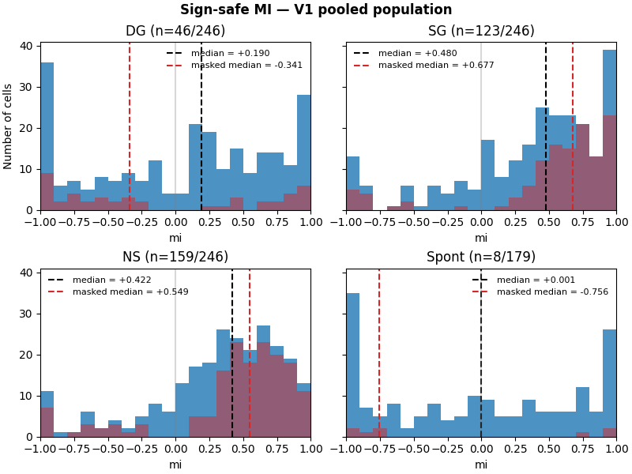

# Running Modulation and Speed Tuning

## 1 Running Modulation

We classify ...

A neuron is *modulated by running* if ...

### 1.1 Number of modulated neurons

for VIpm ...
for V1 pools, numbers increaes with DG, SG and NS, while few for Spont.

### 1.2 Modulation index (sign safe)

We use the sign-safe MI ...

MI of VIpm neurons: 

MI of V1 pool: on population level, MI distribution of SG and NS is more positive.

### 1.3 Simiple gain model

...

## 2 Speed Tuning

### 2.1 Number of tuned neurons

...

### 2.2 Tuning curves by motonocity

...

### 2.3 Tuning profiles in detail

...