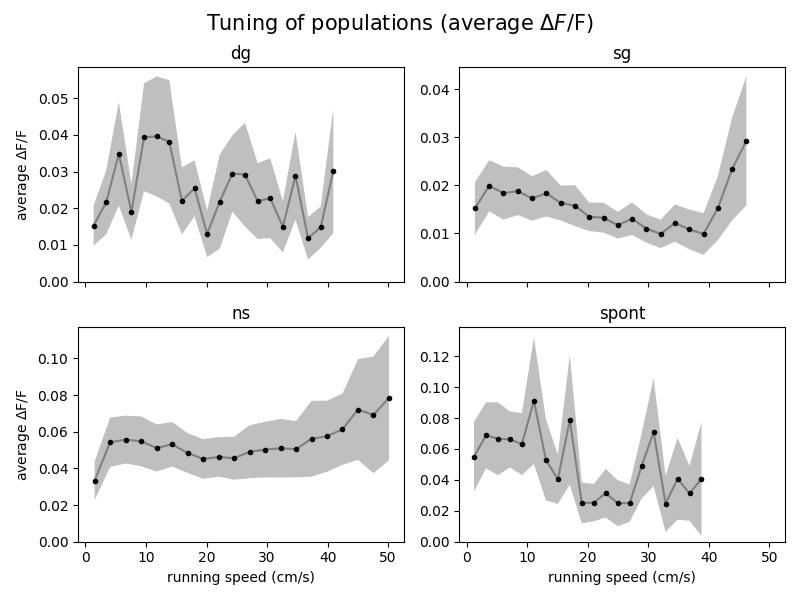
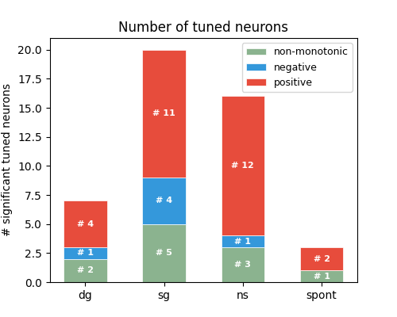
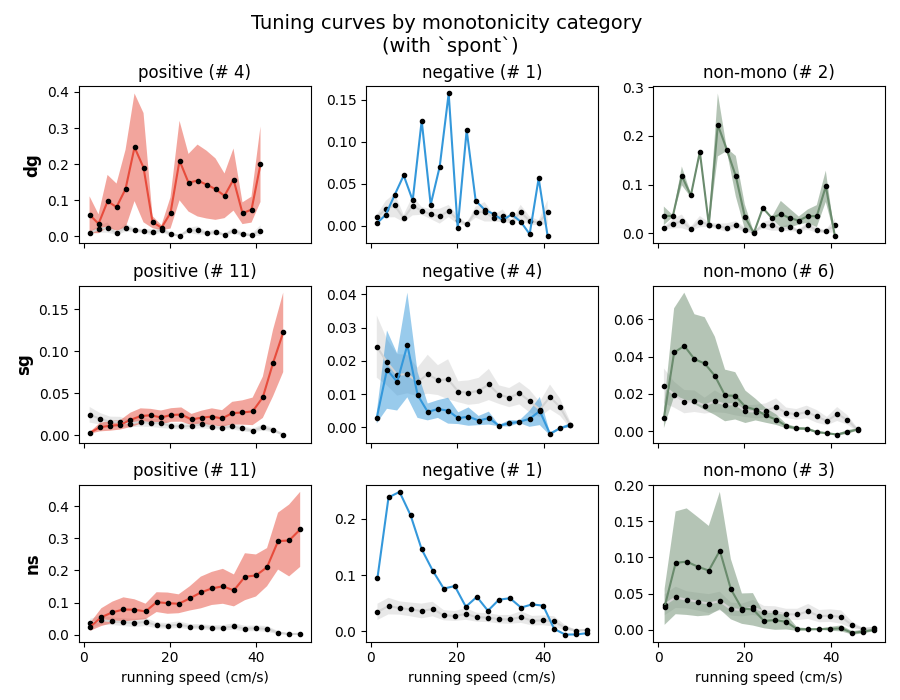
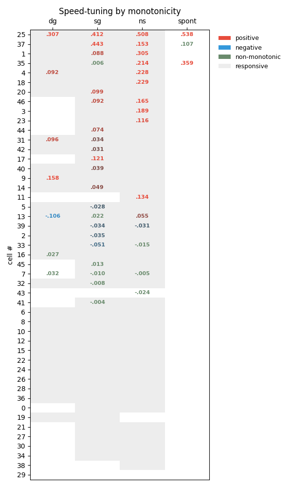

# Speed Tuning

## 1. Methods

As in [`Plan.md`](Plan.md) and [`TASKS.md`](TASKS.md#person-a--analysis-1-speedtuning-medium--shared-reducers), this analysis
1. Bined the resposne ΔF/F by running speeds, compute the average and MSE across neurons to get the tuning curve.
2. Ran **Levene's t test** to obtain the significantly *running-tuned* neurons with $p<0.05$.
3. Within the *tuned* neurons, computed **Spearman's $\rho$** to recognize the (general) *monotonicity* of their tuning, dividing them into 3 groups based on it.
    - Neurons don't show clear monotonicity, i.e. $p>0.05$: `non-monotonic`
    - Neurons have $p>0.05$ and $\rho>0$: `positive`
    - Neurons have $p>0.05$ and $\rho<0$: `negative`

## 2. Results

### 2.1 Tuning curves averaged over all neurons

First we look at the tuning curve average over all neurons, under 3 stimuli and spontaneous conditions. 

It can be seen that there for `drifting_gragings` and `spontaneous` the tuning curve fluctuates a lot, while `static_geratings` and `natural_scenes` shows clearer patterns that are both general 'up-down-up'.

### 2.2 Number of tuned neurons *(To be polished with results from `BinaryModulation`)*

Across the three stimuli, the fewest neurons is tuned to running under `drifting_gratings`, while under `spontaneous` the number is the lowest. 

Therefore, the speed tunings of the 47 V1 neurons are shown to be stimuli-dependent.

### 2.3 Tuning curves grouped by tuning monotonicity
Here we show the tuning curves of neurons grouped by monotonicity across 3 stimuli, along with the tuning under `spontaneous` as baseline. The real line linking dots denotes the average responses, the shadow intervals denotes the MSE. Average Spearman's $\rho$ of the selected neurons is also shown.

Qualitatively, the positive and negative neurons under `static_gratings` and `natural_scenes` show clear pattern on average level that aligns with their monotonicity, and the patterns are especially clean for `static_gratings`. 

By contrast, the average tuning curve under `drifting_gratings` show much more fluctuations for both positive and negative, making it less 'monotonic'.

*(to add the quantitative metrics `MI` computed from `BinaryModulation`)*

### 2.4 Each neuron's tuning
Here we dive into each neuron's tuning monotonicity across 4 different stimuli conditions, along with the `responsive` and `speed-tuned` mask based on the metadata from Allen's : [`neurons_metadata.csv`](../data/neurons_metadata.csv). 

- `responsive` means that the neuron is actively responsive under certain stimuli (`p_dg`, `p_sg`, `p_ns`).
    > "One-way ANOVA comparing all stimulus conditions (including blank sweep)."
- `speed-tuned` means that the neuron is signiticantly tuned by running speed under certain stimuli (`p_run_mod_dg`, `p_run_mod_sg`, `p_run_mod_ns`).
    > "Independent t-test of mean responses to peak stimulus condition when mouse is running (mean speed >1 cm/s) compared to mean responses to peak stimulus condition when mouse is stationary (<1 cm/s)."

